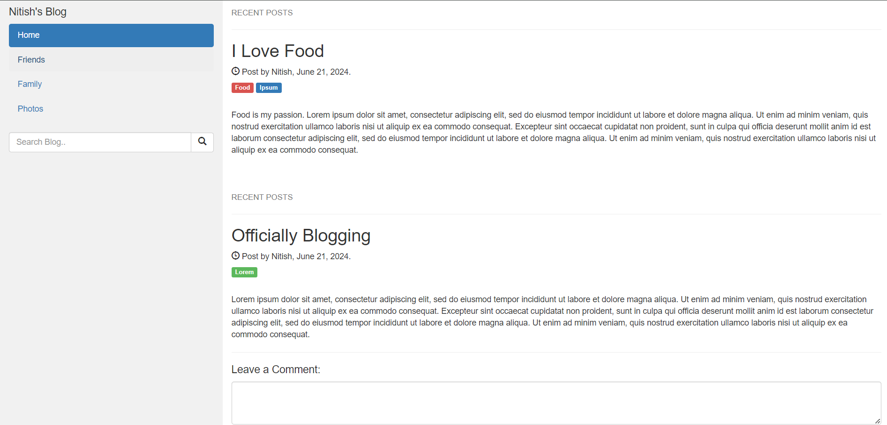

# HTML Resume

Developed simple and stylish resume using only HTML. It includes sections for personal information, introduction, experience, education, skills, and contact details.

## Files Included

- **index.html**: Contains the HTML structure and content of the resume.
- **styles.css**: CSS file for styling the resume.
- **README.md**: This file, providing an overview and instructions for the project.

## Project Structure

The HTML file (`index.html`) is structured with several `
` elements, each representing a section of the resume:

- **Header**: Includes the name and job title.
- **Summary**: A brief overview of the individual's professional profile.
- **Experience**: Details of past work experience.
- **Education**: Information about the individual's educational background.
- **Skills**: List of relevant skills.
- **Footer**: Contact information.

## How to Use

1. Clone the repository or download the files (`index.html` and `styles.css`).
2. Open `index.html` in a web browser to view the resume.
3. Modify the content of `index.html` to fit your own information:
   - Update the name, job title, summary, experience, education, skills, and contact details as needed.
4. Customize the styles in `styles.css` to change colors, fonts, layout, etc., to match your preferences.
5. Save your changes and refresh the browser to see the updated resume.

## Example

Here's a screenshot of what the HTML resume might look like:

